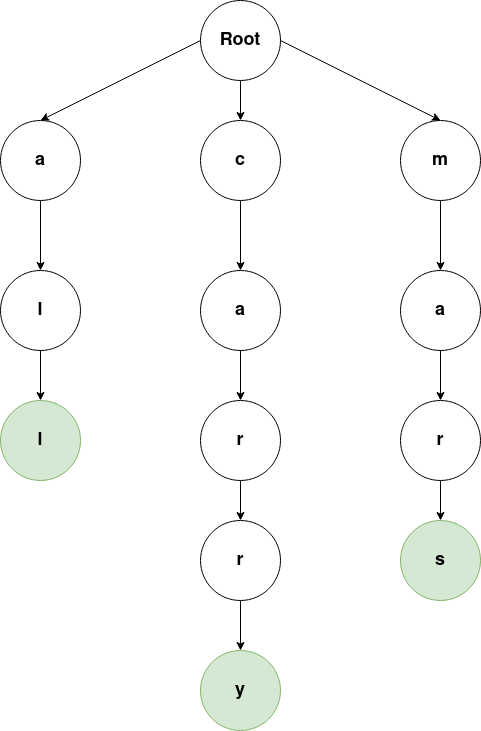

# NaiveTrie

This is a naive implementation of a trie,  is a type of k-ary search tree, a tree data structure used for locating specific keys from within a set[1];

## Example

[1] https://en.wikipedia.org/wiki/Trie